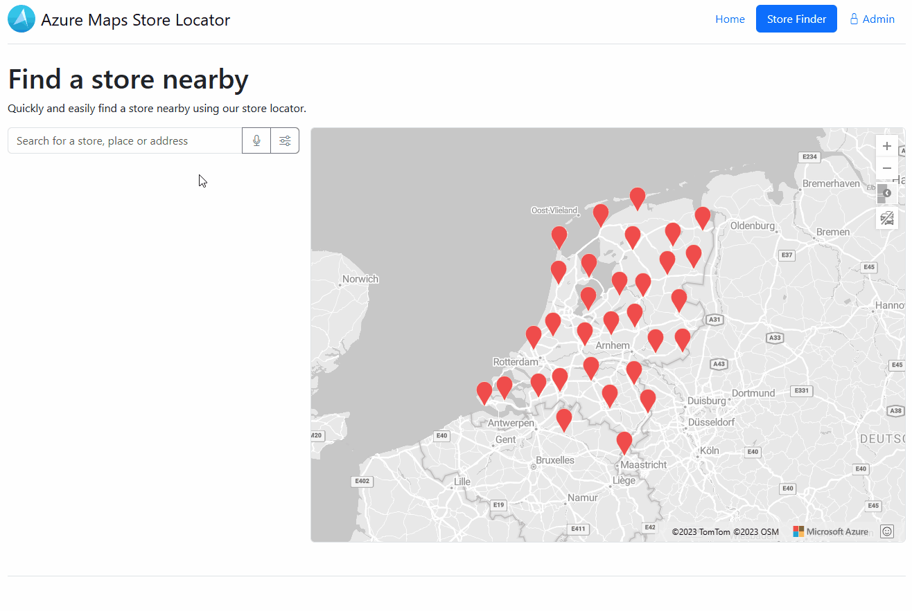
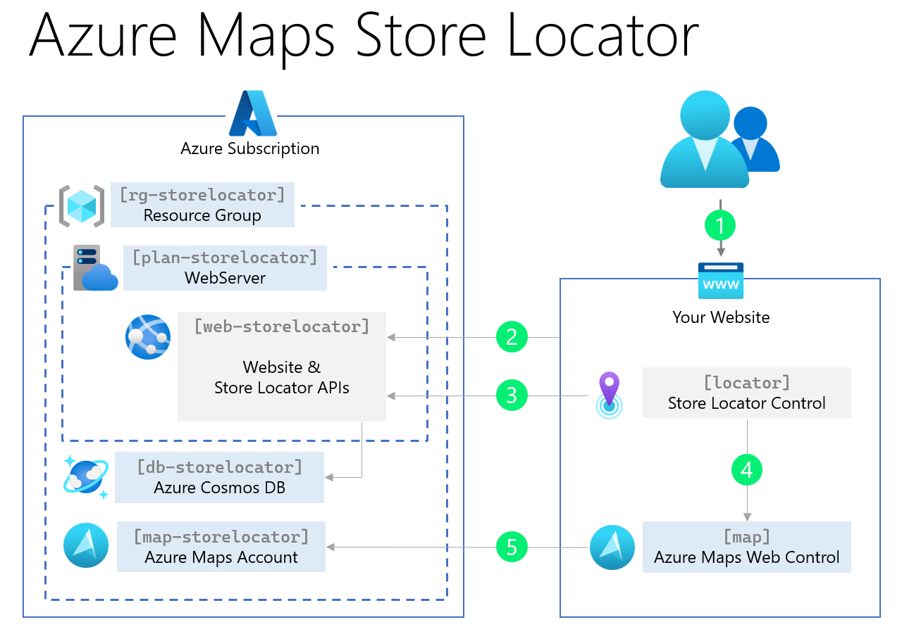
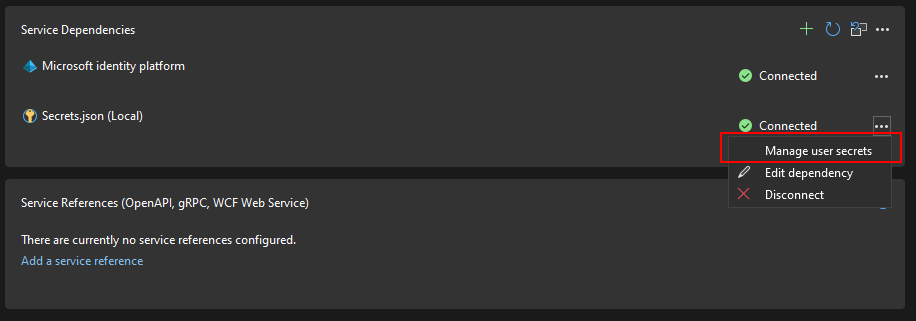

# Azure Maps Store Locator

Welcome to the Azure Maps Store Locator starter project! Enhance your website with a powerful store locator that helps potential customers easily discover your nearest locations based on their preferences. Whether it's finding stores, restaurants, office locations, lockers, or any other place of interest, the Azure Maps Store Locator offers a user-friendly and versatile solution with a comprehensive store location management system.



## Features

The Azure Maps Store Locator starter project provides a range of powerful features, including:

- Autocomplete search for store names, addresses, points of interest (POI), or zip codes.
- Display nearby stores and their distances.
- Show travel time for both walking and driving.
- Present store details via popups and directions.
- Apply filters based on dynamic store features.
- Explore a store detail page with an embedded map.
- Access an admin page for editing and adding store details.
- Enable auto-deployment within your Azure subscription.

## Getting Started in 5 Minutes

Getting started is easy! If you're not a developer, follow these simple steps:

1. **Azure Subscription**: Ensure you have an Azure subscription. If not, sign up for a free Azure subscription [here](https://azure.microsoft.com/free).

2. **Azure Shell**: Log in to the Azure Shell [shell.azure.com](https://shell.azure.com/).

3. **Deployment script**: Run this PowerShell command (copy and paste) to install the Azure Maps Store Locator:

```powershell
iex (iwr "https://samples.azuremaps.com/storelocator/deploy.ps1").Content
```

The output should look similar to this:

```txt
Starting...
- Creating a Resource Group named 'rg-storelocator' in the 'westeurope' location...
- Creating an Azure Maps account named 'map-storelocator'...
- Creating an Azure Cosmos DB server named 'db-storelocator318564045'...
- Creating a database named 'storelocator'...
- Creating a Webserver plan named 'plan-storelocator' for the Website 'web-storelocator318564045'...
- Utilizing managed identities for Azure Maps...
- Creating an Azure AD App registration...
- Storing App Settings...
- Initiating the deployment of the website...
Open https://web-storelocator318564045.azurewebsites.net/ to access your Store Locator.
Done! Your Azure Maps Store Locator infrastructure and website are ready.
```

> [!NOTE]
> Upon initial application launch, a database will be generated, and demo data will be added.
> Please be aware that this may result in some temporary performance fluctuations during the initial startup.

## Prerequisites for Developers

For developers who need more control, follow the steps below to set up your development environment for the Azure Maps Store Locator.

1. **Azure Subscription**: Sign up for a free Azure subscription [here](https://azure.microsoft.com/free).

2. **.NET 8 Framework**: Install the .NET 8 framework from [dot.net](https://dot.net/).

3. **Azure Command-Line Interface (CLI) Tools**: Learn how to install the Azure CLI by following the instructions [here](https://docs.microsoft.com/en-us/cli/azure/install-azure-cli).

4. **Visual Studio 2022**: Download and install Visual Studio 2022 from [visualstudio.microsoft.com](https://visualstudio.microsoft.com/).

5. **CosmosDB Emulator**: Download and install the CosmosDB Emulator from [here](https://docs.microsoft.com/en-us/azure/cosmos-db/local-emulator).

## Getting Started

Follow these steps to get started with the Azure Maps Store Locator project:

### Azure Infrastructure

1. **(Optional)** Run the PowerShell script `.\deployment\deploy.ps1`. This script sets up the initial Azure services required for this project. Before running, review the [architecture diagram](Images/Architecture.png) to understand what will be created.



### Demo Data

2. Launch Visual Studio and update the connection string in the `Secrets.json` file for the Cosmos DB in the `Bulk Data Injector` project.

```json
{
  "Database": {
    "Name": "storelocator",
    "ConnectionString": "AccountEndpoint=https://localhost:8081/;AccountKey=[your_key]"
  }
}
```



3. Execute the `Bulk Data Injector` project to load the initial data into the backend.

### Run the Store Locator Application

4. Update the connection string in the `Secrets.json` file for the Cosmos DB in the `Store Locator Website` project.

```json
{
  "Database": {
    "Name": "storelocator",
    "ConnectionString": "AccountEndpoint=https://localhost:8081/;AccountKey=[your_key]"
  },
  "AzureMaps": {
    "ClientId": "11111111-1111-1111-1111-111111111111",
    "TokenUrl": "https://[your_storelocator_url].azurewebsites.net/api/azuremaps/token"
  },
  "AzureAd": {
    "Instance": "https://login.microsoftonline.com/",
    "Domain": "[your_domain].onmicrosoft.com",
    "TenantId": "11111111-1111-1111-1111-111111111111",
    "ClientId": "22222222-2222-2222-2222-222222222222",
    "CallbackPath": "/signin-oidc",
    "Scopes": ""
  }
}
```

5. Add in the Azure Portal the URL `https://localhost:7074` to the CORS list for the website and Azure Maps.

6. Run the `Store Locator Website` project to see the application in action.

> [!NOTE]
> For automatic minification of the `storelocator.js` file, you can make use of the Visual Studio Extension called "[Bundler & Minifier 2022+](https://marketplace.visualstudio.com/items?itemName=Failwyn.BundlerMinifier64)"

Thank you for your interest in this project! We are actively working to improve and enhance it. If you encounter any issues or have suggestions, please feel free to contribute or reach out to us. Happy coding!
