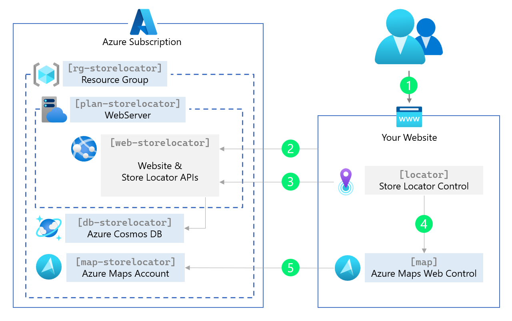

# Azure Maps Store Locator

**Note: This project is currently a work in progress and may undergo changes.**

Welcome to the Azure Maps Store Locator project! Enhance your website with a powerful store locator that helps potential customers easily discover your nearest locations based on their preferences. Whether it's finding stores, restaurants, office locations, lockers, or any other place of interest, the Azure Maps Store Locator offers a user-friendly and versatile solution with a comprehensive store location management system.


## Features

The Azure Maps Store Locator project provides a range of powerful features, including:

- Autocomplete search for store names, addresses, points of interest (POI), or zip codes.
- Display nearby stores and their distances.
- Show travel time for both walking and driving.
- Present store details via popups and directions.
- Apply filters based on store properties or tags.
- Explore a store detail page with an embedded map and weather conditions.
- Access an admin page for editing and adding store details.
- Enable auto deployment within your Azure subscription.

## Getting Started in 5 Minutes for Non-developers

Getting started is easy! If you're not a developer, follow these simple steps:

1. **Azure Subscription**: Ensure you have a Azure subscription. If not, sign up for a free Azure subscription [here](https://azure.microsoft.com/free).

2. **Deployment**: Click on the deployment button, and the Azure Maps Store Locator will be automatically installed in your Azure subscription.

<!--  -->

<!-- https://learn.microsoft.com/en-us/azure/azure-resource-manager/templates/deploy-to-azure-button -->

For developers who need more control, follow the steps below to set up your development environment for the Azure Maps Store Locator.

## Prerequisites for Developers

To get started, developers need to have the following prerequisites in place:

1. **Azure Subscription**: Sign up for a free Azure subscription [here](https://azure.microsoft.com/free).

2. **.NET 8 Framework**: Install the .NET 8 framework from [dot.net](https://dot.net/).

3. **Azure Command-Line Interface (CLI) Tools**: Learn how to install the Azure CLI by following the instructions [here](https://docs.microsoft.com/en-us/cli/azure/install-azure-cli).

4. **Visual Studio 2022**: Download and install Visual Studio 2022 from [visualstudio.microsoft.com](https://visualstudio.microsoft.com/).

5. **CosmosDB Emulator**: Download and install the CosmosDB Emulator from [here](https://docs.microsoft.com/en-us/azure/cosmos-db/local-emulator).

## Getting Started

Follow these steps to get started with the Azure Maps Store Locator project:

### Azure Infrastructure

1. **(Optional)** Run the PowerShell script `.\storelocator.ps1`. This script sets up the initial Azure services required for this project. Before running, review the [architecture diagram](Images/Architecture.png) to understand what will be created.



### Demo Data

2. Launch Visual Studio and update the connection string in the `Secrets.json` file for the Cosmos DB in the `Demo Data Injector` project.

```json
{
  "ConnectionStrings:CosmosDB": "AccountEndpoint=https://localhost:8081/;AccountKey=YOUR_LOCAL_KEY;"
}
```


3. Execute the `Demo Data Injector` project to load the initial data into the backend.

### Run the Application

4. Update the connection string in the `Secrets.json` file for the Cosmos DB in the `Store Locator Website` project.

5. Run the `Store Locator Website` project to see the application in action.

Thank you for your interest in this project! We are actively working to improve and enhance it. If you encounter any issues or have suggestions, please feel free to contribute or reach out to us. Happy coding!
